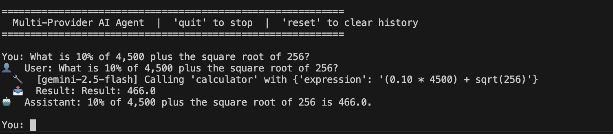

# 🤖 Multi-Provider AI Agent

A single Python AI agent that works with **any provider and any model** — just swap a flag.

| Provider | Models |
|---|---|
| **Anthropic** | claude-3-5-haiku, claude-3-5-sonnet, claude-opus-4-5, ... |
| **Google Gemini** | gemini-2.5-flash, gemini-2.5-pro, gemini-2.5-flash-exp, ... |
| **OpenAI** | gpt-4o-mini, gpt-4o, gpt-4-turbo, o1-mini, ... |

All providers share the same 6 tools: 🧮 calculator · 🕐 datetime · 📂 read file · 💾 write file · 🔍 web search · 🌤️ weather

---

## 🚀 Setup

### Create and activate virtual environment

````shell
python3 -m venv .venv
source .venv/bin/activate
````

### Install dependencies

Install all three providers, or just the one(s) you need:

```bash
pip install -r requirements.txt
```

### Copy .env.example to .env and set API key(s)

```bash
export ANTHROPIC_API_KEY="sk-ant-..."
export GEMINI_API_KEY="AIza..."
export OPENAI_API_KEY="sk-..."
```

Get your keys:
- Anthropic → https://console.anthropic.com
- Gemini    → https://aistudio.google.com/app/apikey
- OpenAI    → https://platform.openai.com/api-keys

---

## ▶️ Running the Agent

### Interactive chat

```bash
python agent.py                          # default: Gemini flash

python agent.py anthropic                # Claude (default model)
python agent.py openai                   # GPT-4o-mini (default)
python agent.py gemini                   # Gemini 2.5 Flash (default)

# Pick any specific model
python agent.py anthropic claude-3-5-sonnet-20241022
python agent.py anthropic claude-opus-4-5
python agent.py openai gpt-4o
python agent.py openai o1-mini
python agent.py gemini gemini-2.5-pro
python agent.py gemini gemini-2.0-flash-001

# Single-shot query (no interactive mode)
python agent.py anthropic claude-3-5-haiku-20241022 "What is sqrt(1764)?"
python agent.py openai gpt-4o-mini "What time is it?"
python agent.py gemini gemini-2.5-flash "Write a haiku and save it to haiku.txt"
```

## 💬 Example Session

```
$ python agent.py openai gpt-4o-mini

✅  OpenAI Agent ready  (gpt-4o-mini)

============================================================
  Multi-Provider AI Agent  |  'quit' to stop  |  'reset' to clear history
============================================================

You: What is 10% of 4,500 plus the square root of 256?



You: reset
🔄  Conversation reset.

You: quit
Goodbye!
```

---

## 🗂️ Project Structure

```
multi_agent/
├── agent.py          # All providers + tools in one file
├── requirements.txt  # Dependencies
└── README.md         # This file
```

---

## 🔌 Adding Real APIs

The `web_search` and `get_weather` tools are simulated. To make them real:

**Web Search (Tavily):**
```bash
pip install tavily-python
```
```python
# In agent.py, replace web_search():
from tavily import TavilyClient
def web_search(query: str) -> str:
    client = TavilyClient(api_key=os.environ["TAVILY_API_KEY"])
    return "\n".join(r["content"] for r in client.search(query)["results"][:3])
```

**Weather (OpenWeatherMap):**
```bash
pip install requests
```
```python
# In agent.py, replace get_weather():
import requests
def get_weather(city: str) -> str:
    r = requests.get("https://api.openweathermap.org/data/2.5/weather",
        params={"q": city, "appid": os.environ["OWM_API_KEY"], "units": "metric"})
    d = r.json()
    return f"{city}: {d['main']['temp']}°C, {d['weather'][0]['description']}"
```

---

## ➕ Adding a New Tool

1. Write a Python function in `agent.py`
2. Add it to `TOOL_FUNCTIONS` dict
3. Add its schema to `TOOL_SCHEMAS` list

That's it — all three providers will automatically pick it up.

---

## 📋 Default Models

| Provider | Default Model |
|---|---|
| `anthropic` | `claude-3-5-haiku-20241022` |
| `gemini` | `gemini-2.5-flash` |
| `openai` | `gpt-4o-mini` |

Override any default by passing the model name as the second argument.
